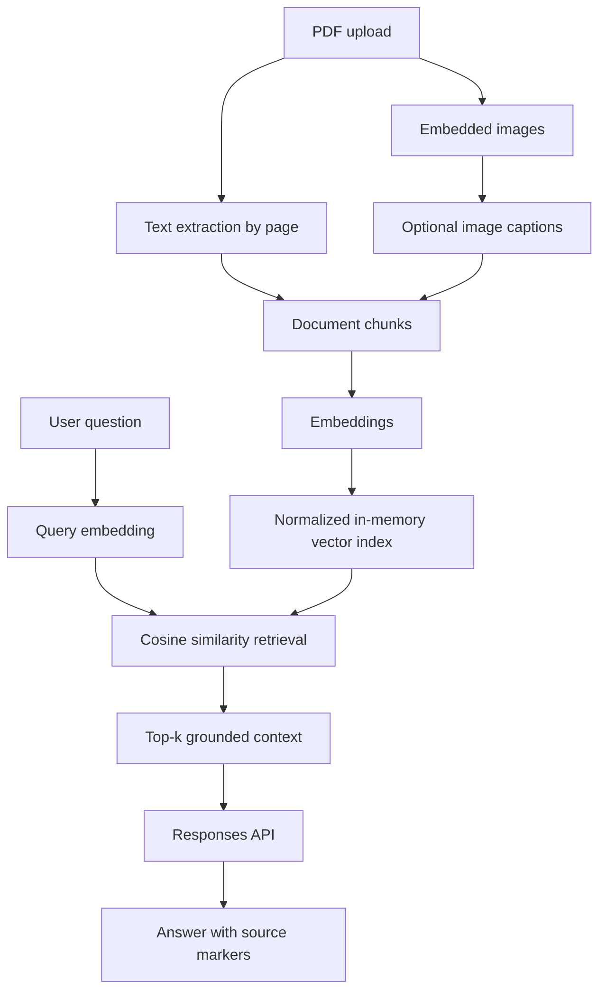

# Document AI Assistant

A compact **multimodal Retrieval-Augmented Generation (RAG)** application for asking grounded questions about PDF documents.

This project evolved from earlier document-QA and chatbot experiments. The current implementation keeps the focus on document understanding while rebuilding the architecture around explicit, testable components.

## What it demonstrates

- PDF text extraction with page-level provenance
- Optional image extraction and AI-generated image captions
- Semantic embeddings and transparent in-memory cosine retrieval
- Grounded question answering through the OpenAI Responses API
- Source markers in generated answers
- Streamlit user interface with retrieved-context inspection
- Unit-tested retrieval logic with no external service dependency

## Architecture



The vector index is deliberately implemented with normalized NumPy arrays rather than hidden behind a framework. For a single-document portfolio demo this keeps retrieval behavior easy to inspect, test, and explain. A production deployment could replace it with a persistent vector database without changing the ingestion and generation boundaries.

## Project structure

```text
.
├── app.py
├── src/document_ai/
│   ├── config.py
│   ├── llm.py
│   ├── models.py
│   ├── pdf.py
│   └── retrieval.py
├── tests/
│   └── test_retrieval.py
├── .env.example
└── pyproject.toml
```

## Local setup

Requirements: **Python 3.11+** and an OpenAI API key.

```bash
python -m venv .venv
source .venv/bin/activate        # macOS/Linux
# .venv\Scripts\activate       # Windows

pip install -e ".[dev]"
cp .env.example .env
```

Set `OPENAI_API_KEY` in `.env`, then run:

```bash
streamlit run app.py
```

## Configuration

| Variable | Purpose | Default |
|---|---|---|
| `OPENAI_API_KEY` | API credential | required |
| `OPENAI_CHAT_MODEL` | Answering + optional image-caption model | `gpt-5.6-luna` |
| `OPENAI_EMBEDDING_MODEL` | Embedding model | `text-embedding-3-small` |
| `ENABLE_IMAGE_CAPTIONS` | Include embedded images during ingestion | `true` |
| `TOP_K` | Retrieved chunks per question | `5` |

## Quality checks

```bash
pytest
ruff check .
```

The unit tests intentionally cover retrieval behavior without calling OpenAI, so they can run cheaply in CI.

## Design decisions

### Why not a heavy RAG framework?

The original experiment used LangChain. The modernization removes it from the core retrieval path so that chunking, embeddings, ranking, provenance, and prompting are visible in the repository. This makes the project easier to evaluate technically and reduces framework coupling.

### Why in-memory retrieval?

This demo targets one uploaded PDF per session. For that workload, a persistent vector database would add infrastructure without demonstrating better retrieval. The `retrieval.py` boundary is intentionally small so FAISS, pgvector, Qdrant, or another backend can be added later.

### Why turn images into captions?

The earlier project already experimented with image-aware PDF understanding. Image captions keep that capability while making both text and visual information searchable through the same retrieval path.

## Validation before portfolio release

This branch is the first modernization pass, not the final showcase. Before extracting it to its own repository, the next checks are:

- run against representative PDFs: text-only, reports with charts, and mixed layouts
- build a small retrieval evaluation set with expected source pages
- measure retrieval quality, latency, and API usage
- add screenshots / a short demo
- decide on deployment and license
- extract this directory into its own public repository once validated

## Project evolution

The current implementation supersedes the earlier document-QA and chatbot prototypes and is the maintained version of the project.
