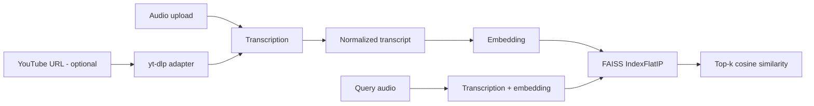

# Semantic Cover Search

A semantic audio-search experiment for finding **cover songs and lyrically similar performances** from their transcribed content.

This project evolved from an earlier cover-search experiment. The core idea is preserved—transcribe songs, embed the lyrics, and search by semantic similarity—but the implementation is now split into testable components and no longer makes YouTube a hard dependency.

## Pipeline



## What changed from the original experiment

- **Stable primary input:** uploaded audio works independently of YouTube.
- **Optional YouTube adapter:** `yt-dlp` is isolated behind an optional dependency because third-party extraction behavior changes over time.
- **No model reload per song:** transcription is provided through a dedicated service instead of loading Whisper inside every URL request.
- **Correct embedding input:** segmented transcription output is normalized into one text string before embedding.
- **Explicit vector index:** normalized embeddings use FAISS inner-product search as cosine similarity.
- **Testable core:** ranking, duplicate detection, transcription normalization, and embedding normalization are covered without real API calls.

## Stack

- Python 3.11+
- OpenAI transcription API (`gpt-transcribe` by default)
- OpenAI embeddings (`text-embedding-3-small` by default)
- FAISS
- Gradio
- optional `yt-dlp`

## Project structure

```text
.
├── app.py
├── src/cover_search/
│   ├── config.py
│   ├── index.py
│   ├── models.py
│   ├── services.py
│   └── youtube.py
├── tests/
│   ├── test_index.py
│   └── test_services.py
├── .env.example
└── pyproject.toml
```

## Setup

```bash
python -m venv .venv
source .venv/bin/activate        # macOS/Linux
# .venv\Scripts\activate       # Windows

pip install -e ".[dev]"
cp .env.example .env
```

Set `OPENAI_API_KEY` in `.env`, then run:

```bash
python app.py
```

For optional YouTube input:

```bash
pip install -e ".[youtube,dev]"
```

## Configuration

| Variable | Purpose | Default |
|---|---|---|
| `OPENAI_API_KEY` | API credential | required |
| `OPENAI_TRANSCRIPTION_MODEL` | speech-to-text model | `gpt-transcribe` |
| `OPENAI_EMBEDDING_MODEL` | semantic embedding model | `text-embedding-3-small` |

## Quality checks

```bash
ruff check .
pytest -q
```

## Retrieval notes

FAISS `IndexFlatIP` returns inner-product scores. Because every stored/query vector is L2-normalized, the score is equivalent to cosine similarity. The UI reports this value as a percentage-like similarity score for exploration; it should **not** be interpreted as a calibrated probability that two recordings are covers of the same song.

## Current scope and next validation

This modernization pass establishes a reproducible architecture. Before portfolio release it still needs empirical validation:

- create a small labelled set containing originals, known covers, and unrelated songs
- measure Recall@K / ranking quality
- compare transcription providers and embedding models
- test multilingual covers and translated lyrics
- evaluate robustness to instrumental sections and noisy recordings
- add screenshots / demo media after the UI is validated

## Project evolution

This implementation supersedes the earlier prototype and is the maintained version of the project.
